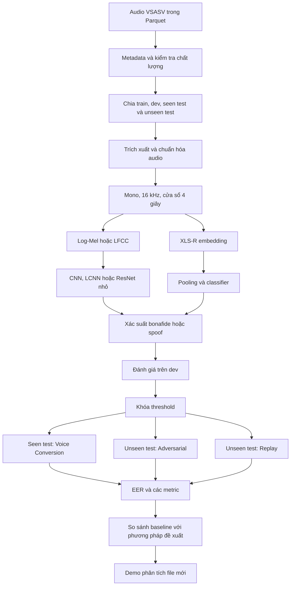
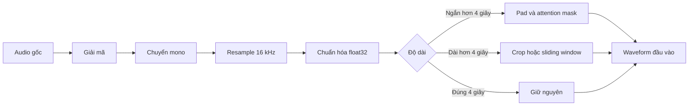
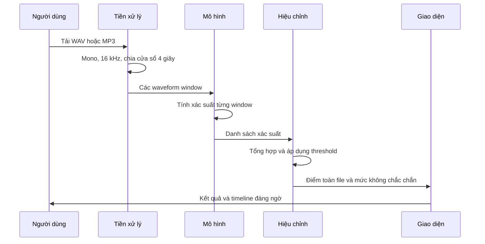

# Tài liệu tổng quan lịch sử trước khi thu hẹp phạm vi

> **Không dùng tài liệu này làm phạm vi hiện hành.** Các phần tổng quát hóa, channel consistency và ký hiệu mô hình cũ chỉ còn giá trị tham khảo lịch sử. Phạm vi hiện hành là phân loại nhị phân thật/giả với B0 (LFCC + LCNN), X0 (XLS-R đóng băng) và X1 (XLS-R fine-tune một phần). Xem `lo_trinh_hoan_chinh_do_an_deepfake_tieng_viet.md` và quyết định D008-D009 trong `docs/decisions.md`.

## 1. Bài toán đồ án giải quyết

Đồ án xây dựng một hệ thống nhận một đoạn âm thanh tiếng Việt và xác định đoạn âm thanh đó có khả năng là giọng thật hay giọng bị giả mạo.

Đầu vào:

```text
File WAV hoặc MP3 chứa giọng nói tiếng Việt
```

Đầu ra:

```text
Xác suất deepfake từ 0% đến 100%
Mức kết luận: có khả năng thật, không chắc chắn hoặc có khả năng giả
Timeline các đoạn âm thanh đáng ngờ
```

Mục tiêu nghiên cứu không chỉ là đạt độ chính xác cao mà còn kiểm tra xem mô hình có phát hiện được:

- Người nói chưa từng xuất hiện khi huấn luyện.
- Kiểu tấn công chưa từng xuất hiện khi huấn luyện.
- Audio bị nén, thêm nhiễu hoặc truyền qua điều kiện kênh khác.
- Replay hoặc adversarial attack dù mô hình chỉ được huấn luyện bằng voice conversion.

## 2. Luồng hoạt động tổng thể



Hệ thống gồm năm tầng chính:

1. Dữ liệu.
2. Tiền xử lý.
3. Mô hình.
4. Huấn luyện và đánh giá.
5. Demo suy luận.

## 3. Tầng dữ liệu

### 3.1. Dữ liệu VSASV

Metadata VSASV hiện có:

- 220.963 mẫu.
- 1.141 người nói.
- 98.305 mẫu bonafide.
- 60.949 mẫu voice conversion.
- 60.949 mẫu adversarial attack.
- 760 mẫu replay.

Năm file Parquet đầu tiên được chọn cho smoke test chứa 2.558 audio:

- 1.292 bonafide.
- 188 voice conversion.
- 813 adversarial attack.
- 265 replay.

### 3.2. Vì sao phải chia theo người nói?

Nếu cùng một người nói xuất hiện ở cả train và test, mô hình có thể ghi nhớ đặc điểm giọng của người đó. Kết quả test khi ấy có thể rất cao nhưng không phản ánh đúng khả năng phát hiện deepfake.

Đồ án áp dụng nguyên tắc:

```text
Speaker trong train ∩ speaker trong dev = rỗng
Speaker trong train ∩ speaker trong test = rỗng
Speaker trong dev ∩ speaker trong test = rỗng
```

Mọi file của cùng một speaker phải nằm trong cùng một partition.

### 3.3. Vai trò của từng split

| Split | Nội dung | Mục đích |
|---|---|---|
| `open_train_vc` | Bonafide và voice conversion | Huấn luyện |
| `open_dev_vc` | Bonafide và voice conversion của speaker mới | Chọn epoch, threshold và siêu tham số |
| `open_seen_test_vc` | Bonafide và voice conversion | Kiểm tra attack đã biết |
| `open_unseen_test_adversarial` | Bonafide và adversarial attack | Kiểm tra attack chưa học |
| `open_unseen_test_replay` | Bonafide và replay | Kiểm tra speaker và attack đều chưa thấy |

Điểm chính của giao thức là mô hình chỉ học từ voice conversion nhưng phải thử phát hiện adversarial attack và replay.

## 4. Tiền xử lý âm thanh

Mỗi file được chuyển thành waveform theo quy trình:



### 4.1. Khi huấn luyện

Với file dài, hệ thống lấy ngẫu nhiên một đoạn 4 giây. Điều này giúp mô hình không ghi nhớ một vị trí cố định trong file.

### 4.2. Khi đánh giá

Hệ thống không chỉ lấy 4 giây đầu mà chạy theo cửa sổ:

```text
Window: 4 giây
Hop:    2 giây
```

Ví dụ với file dài 10 giây:

```text
Cửa sổ 1: 0–4 giây
Cửa sổ 2: 2–6 giây
Cửa sổ 3: 4–8 giây
Cửa sổ 4: 6–10 giây
```

Mỗi cửa sổ có một xác suất deepfake. Các xác suất sau đó được tổng hợp thành điểm của toàn file.

## 5. Mô hình học điều gì?

Mô hình không hiểu nội dung câu nói theo nghĩa ngôn ngữ. Nó tìm các dấu vết trong tín hiệu, chẳng hạn:

- Phổ âm thanh bất thường.
- Chuyển tiếp giữa các âm vị thiếu tự nhiên.
- Năng lượng hoặc pha có cấu trúc lạ.
- Dấu vết của vocoder hoặc voice conversion.
- Nhịp thở, khoảng dừng hoặc nhiễu nền không tự nhiên.
- Sự không nhất quán giữa các đoạn trong cùng file.

Mô hình cũng có nguy cơ học nhầm các yếu tố không liên quan trực tiếp đến deepfake:

- Codec.
- Thiết bị thu.
- Mức âm lượng.
- Độ dài file.
- Nhiễu đặc trưng của một corpus.
- Danh tính người nói.

Vì vậy, split chống rò rỉ và augmentation là phần quan trọng ngang với kiến trúc mô hình.

## 6. Các mô hình được thực hiện

### 6.1. Baseline B0 — Log-Mel hoặc LFCC và CNN

```text
Waveform
→ Spectrogram Log-Mel hoặc LFCC
→ CNN, LCNN hoặc ResNet nhỏ
→ Linear classifier
→ Xác suất spoof
```

Mô hình này được dùng để:

- Kiểm tra pipeline end-to-end.
- Tìm lỗi dữ liệu.
- Tạo mốc so sánh cơ bản.
- Huấn luyện trên GPU nhỏ.

### 6.2. Baseline B2 — XLS-R đóng băng

```text
Waveform 16 kHz
→ XLS-R 300M
→ Embedding theo thời gian
→ Attentive statistics pooling
→ Classifier
→ Xác suất spoof
```

XLS-R đã học biểu diễn giọng nói từ dữ liệu lớn. Trong baseline, encoder được đóng băng và chỉ huấn luyện classifier phía sau.

Ưu điểm:

- Giảm chi phí GPU.
- Giảm nguy cơ overfit.
- Tận dụng biểu diễn speech đã được học trước.

### 6.3. M1 — XLS-R với channel augmentation

Trong quá trình huấn luyện, audio được tạo thêm các phiên bản:

- MP3.
- Thêm nhiễu.
- Resample 16 kHz xuống 8 kHz rồi trở lại 16 kHz.
- Thay đổi gain.
- Room impulse response.
- Speed perturbation.
- Clipping nhẹ.

Augmentation phải áp dụng cho cả bonafide và spoof. Nếu chỉ làm biến đổi một lớp, mô hình có thể học nhận diện augmentation thay vì deepfake.

### 6.4. M2 — Channel consistency

Đây là phương pháp đề xuất chính.

Từ một audio `x`, hệ thống tạo phiên bản biến đổi `T(x)`:

```text
Audio sạch x ────────────→ Mô hình → p_clean
       │
       └→ Nén/thêm nhiễu → Mô hình → p_aug
```

Mô hình được yêu cầu:

1. Dự đoán đúng nhãn của audio sạch.
2. Dự đoán đúng nhãn của audio biến đổi.
3. Cho kết quả tương đối nhất quán giữa hai phiên bản.

Loss tổng quát:

```text
L_total =
    L_classification(clean)
  + L_classification(augmented)
  + λ × L_consistency(clean, augmented)
```

Ý tưởng là nếu một đoạn vẫn là deepfake sau khi nén MP3 hoặc thêm nhiễu, mô hình không nên thay đổi kết luận quá mạnh.

## 7. Quá trình huấn luyện

Một batch huấn luyện gồm waveform và nhãn:

```text
bonafide → 0
spoof    → 1
```

Mỗi vòng lặp huấn luyện thực hiện:

1. Đọc audio.
2. Chuẩn hóa waveform.
3. Lấy đoạn 4 giây.
4. Có thể tạo augmentation.
5. Đưa waveform qua mô hình.
6. Tính loss.
7. Lan truyền ngược.
8. Cập nhật trọng số.
9. Đánh giá trên dev.
10. Lưu checkpoint tốt nhất theo dev EER.

Không được sử dụng test để:

- Chọn epoch.
- Chọn learning rate.
- Chọn threshold.
- Chọn loại augmentation.
- Chọn hệ số consistency loss.

Nếu dùng test để chọn các tham số này, test không còn là dữ liệu chưa biết.

## 8. Hệ thống đánh giá

### 8.1. Equal Error Rate

EER là chỉ số chính cho bài toán phát hiện giả mạo.

Hệ thống có hai loại lỗi:

- Giọng thật bị kết luận là giả.
- Giọng giả bị kết luận là thật.

EER là điểm mà tỷ lệ hai loại lỗi bằng nhau. EER càng thấp càng tốt.

Ví dụ:

```text
B0 seen EER:                8%
B0 unseen adversarial EER: 18%

M2 seen EER:                8%
M2 unseen adversarial EER: 12%
```

Trong ví dụ này, M2 không cải thiện seen test nhưng tổng quát tốt hơn trên attack chưa thấy.

### 8.2. Generalization Gap

```text
Generalization Gap = EER_unseen − EER_seen
```

Ví dụ:

```text
EER seen   = 8%
EER unseen = 18%
Gap        = 10 điểm phần trăm
```

Gap nhỏ cho thấy mô hình ít suy giảm hơn khi gặp attack mới.

### 8.3. Worst-group EER

Tính EER cho từng điều kiện rồi lấy giá trị tệ nhất:

```text
Worst-group EER = max(
    EER_voice_conversion,
    EER_adversarial,
    EER_replay,
    EER_codec,
    EER_noise
)
```

Chỉ số này giúp tránh việc kết quả trung bình tốt nhưng mô hình thất bại hoàn toàn trên một nhóm nhỏ.

## 9. Demo cuối hoạt động như thế nào?

Khi người dùng tải một file lên:



Giao diện dự kiến hiển thị:

- Xác suất deepfake toàn file.
- Waveform.
- Xác suất theo từng cửa sổ thời gian.
- Các đoạn đáng ngờ.
- Vùng không chắc chắn.
- Cảnh báo rằng kết quả không phải bằng chứng pháp lý.

## 10. Đóng góp của đồ án

Đồ án không cần tự huấn luyện một foundation model mới. Đóng góp tập trung vào ba phần.

### 10.1. Giao thức dữ liệu đáng tin cậy

- Chia theo speaker.
- Không rò rỉ file hoặc hash.
- Phân biệt seen và unseen attack.
- Có thể tái lập bằng seed và checksum.

### 10.2. Đánh giá khả năng tổng quát hóa

Đồ án không chỉ báo cáo accuracy chung mà đo:

- Seen EER.
- Unseen adversarial EER.
- Replay EER.
- Generalization Gap.
- Worst-group EER.
- EER dưới biến đổi codec hoặc nhiễu.

### 10.3. Phương pháp channel consistency

Đồ án kiểm tra giả thuyết:

> Việc ép mô hình dự đoán nhất quán giữa audio sạch và audio bị biến đổi có giúp phát hiện tốt hơn các điều kiện chưa thấy hay không?

Ngay cả khi kết quả không cải thiện, việc phân tích rõ điều kiện thất bại vẫn là một kết quả nghiên cứu có giá trị.

## 11. Trạng thái hiện tại

Đã hoàn thành:

- Audit metadata.
- Khóa giao thức split.
- Tạo tám file split.
- Kiểm tra rò rỉ ở mức metadata.
- Tải 5 shard chứa 2.558 audio.

Luồng công việc tiếp theo:

```text
Parquet
→ trích xuất WAV
→ tạo smoke subset
→ audit audio
→ xây DataLoader
→ cài metric EER
→ huấn luyện baseline B0
```

Chưa nên thực hiện ngay:

- Tải toàn bộ bộ dữ liệu.
- Huấn luyện XLS-R.
- Xây demo.
- Tối ưu accuracy.

Pipeline nhỏ phải chạy ổn định trước khi mở rộng thí nghiệm.

## 12. Giới hạn cần ghi rõ

VSASV hiện không có TTS hoặc `generator_id` đầy đủ. Vì vậy, đồ án có thể tuyên bố:

> Tổng quát hóa trên unseen spoofing attacks.

Không nên tuyên bố:

> Tổng quát hóa trên unseen TTS engines.

Replay chỉ có 760 mẫu nên accuracy tổng không phản ánh đầy đủ chất lượng trên nhóm này. Cần báo cáo riêng replay EER và Worst-group EER.

Kết quả detector chỉ là công cụ hỗ trợ sàng lọc. Nó không phải bằng chứng pháp lý để khẳng định một file âm thanh chắc chắn là thật hoặc giả.

## 13. Tài liệu liên quan

- [Lộ trình hoàn chỉnh](../lo_trinh_hoan_chinh_do_an_deepfake_tieng_viet.md)
- [Đề cương chi tiết](../baocao/De_cuong_DATN_Nguyen_Ngoc_Tan_cap_nhat.docx)
- [Giao thức chia dữ liệu](split_protocol.md)
- [Nhật ký quyết định](decisions.md)
- [Báo cáo tạo split](../reports/split_summary.md)
- [Báo cáo kiểm tra rò rỉ](../reports/leakage_check.md)
